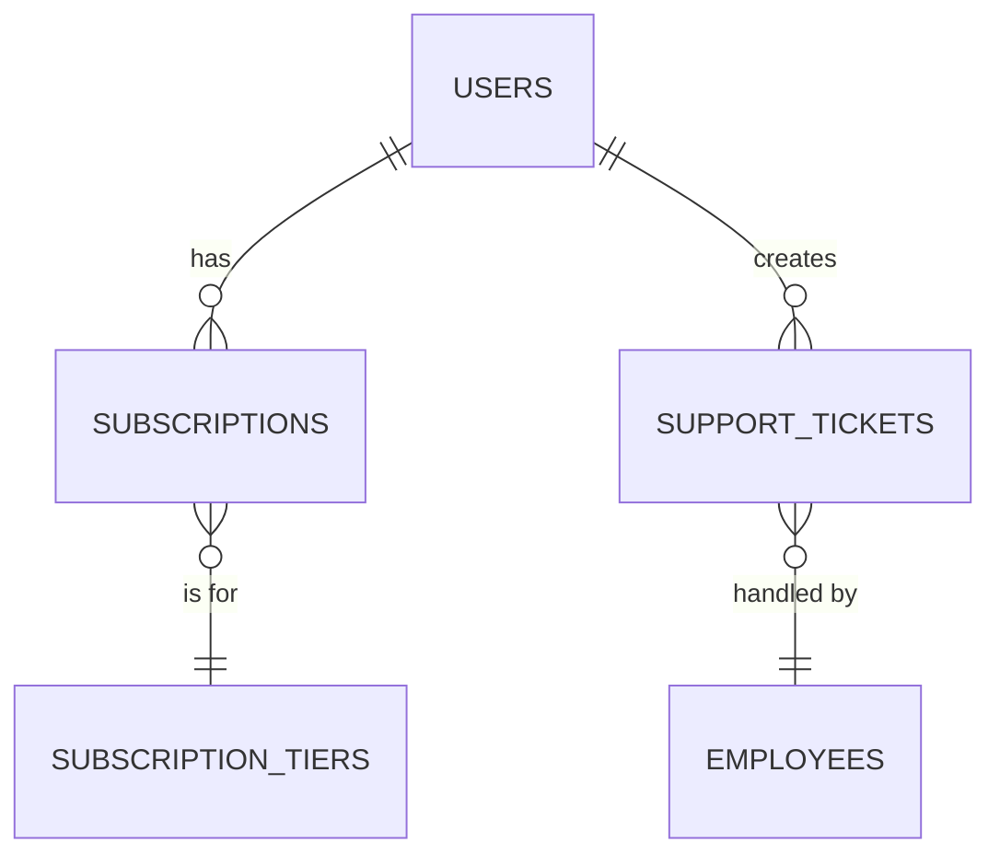

# Sample Subscription Business Database

This project provides a sample SQLite database for a subscription business, generated using R. The schema is designed for analytics and data warehousing exercises, featuring SCD2 (Slowly Changing Dimension Type 2) tables for subscriptions and support tickets.

## Entity-Relationship Diagram



## Tables
- **users**: Customer information
- **subscriptions**: SCD2 table, tracks subscription history (no overlap per user)
- **subscription_tiers**: Subscription plan details
- **support_tickets**: SCD2 table, tracks support ticket history (can overlap)
- **employees**: Support staff

## How to Generate the Database
1. Ensure R and the required packages (`DBI`, `RSQLite`, `dplyr`, `lubridate`) are installed.
2. Run `generate_and_upload.R` to create `sample_subscription_db.sqlite`.

## Example Test Queries

```sql
-- 1. List all current subscriptions and their users
SELECT u.first_name, u.last_name, s.*
FROM subscriptions s
JOIN users u ON s.user_id = u.user_id
WHERE s.is_current = 1;

-- 2. Find all support tickets handled by each employee
SELECT e.first_name, e.last_name, t.*
FROM support_tickets t
JOIN employees e ON t.employee_id = e.employee_id;

-- 3. Show subscription history for a user
SELECT * FROM subscriptions WHERE user_id = 1 ORDER BY effective_from;

-- 4. List all users with overlapping support tickets
SELECT user_id, COUNT(*) as ticket_count
FROM support_tickets
GROUP BY user_id
HAVING ticket_count > 1;

-- 5. List all available subscription tiers
SELECT * FROM subscription_tiers;
```

## Data Dictionary

| Table                | Field            | Type        | Description                                 |
|----------------------|------------------|-------------|---------------------------------------------|
| users                | user_id          | INTEGER     | Primary key                                 |
|                      | first_name       | TEXT        | User's first name                           |
|                      | last_name        | TEXT        | User's last name                            |
|                      | email            | TEXT        | User's email (unique)                       |
|                      | signup_date      | DATE        | Date user signed up                         |
| subscriptions        | subscription_sk  | INTEGER     | Surrogate key (PK)                          |
|                      | user_id          | INTEGER     | Foreign key to users                        |
|                      | tier_id          | INTEGER     | Foreign key to subscription_tiers           |
|                      | start_date       | DATE        | Subscription start date                     |
|                      | end_date         | DATE        | Subscription end date                       |
|                      | effective_from   | DATE        | SCD2 effective from                         |
|                      | effective_to     | DATE        | SCD2 effective to                           |
|                      | is_current       | INTEGER     | 1 if current, 0 otherwise                   |
| subscription_tiers   | tier_id          | INTEGER     | Primary key                                 |
|                      | tier_name        | TEXT        | Name of the subscription tier               |
|                      | monthly_price    | REAL        | Monthly price of the tier                   |
| support_tickets      | ticket_sk        | INTEGER     | Surrogate key (PK)                          |
|                      | user_id          | INTEGER     | Foreign key to users                        |
|                      | employee_id      | INTEGER     | Foreign key to employees                    |
|                      | subject          | TEXT        | Ticket subject                              |
|                      | status           | TEXT        | Ticket status                               |
|                      | effective_from   | DATE        | SCD2 effective from                         |
|                      | effective_to     | DATE        | SCD2 effective to                           |
|                      | is_current       | INTEGER     | 1 if current, 0 otherwise                   |
| employees            | employee_id      | INTEGER     | Primary key                                 |
|                      | first_name       | TEXT        | Employee's first name                       |
|                      | last_name        | TEXT        | Employee's last name                        |
|                      | department       | TEXT        | Department                                  |
|                      | manager_id       | INTEGER     | Employee's manager (nullable, ragged)       |

---

This database is ideal for practicing SCD2 queries, joins, and analytics in a subscription business context.
